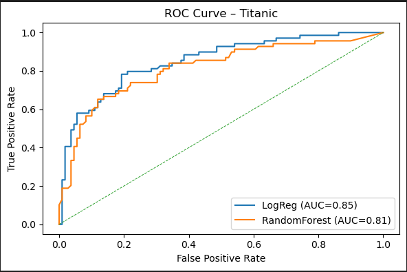

# Data-Science Portfolio

Personal data-science projects & notebooks  
**Ashish Thomas – Georgia Tech CS + Econ (rising junior)**

---

| Project | Description | Tech |
|---------|-------------|------|
| `titanic_eda.ipynb` | Exploratory data analysis of Titanic survival data; descriptive stats & visualisations. | pandas, seaborn |
| `titanic_model.ipynb` | Logistic-regression and random-forest models, ROC-AUC comparison, confusion matrix, feature importance. | scikit-learn |

<p align="center">
  
</p>

**Key takeaway:**  
A random-forest classifier improves ROC-AUC by ~6 pp over a logistic-regression baseline.  
Top predictive features were passenger class and gender, confirming historical accounts that first-class women had the highest survival odds.

---
## About the author

👋 Hi, I’m **Ashish Thomas** — a dual major in Computer Science and Economics at Georgia Tech (rising junior).  
I enjoy turning messy data into clear, actionable insights and am currently seeking **Summer 2026 data-science internships**.

- 🌱 Interests: machine learning, causal inference, fintech  
- 💬 Ask me about this portfolio or my coursework in ML4T, Econometrics, and Systems Design  
- 📫 Connect: ([LinkedIn](https://www.linkedin.com/in/ashishtho) • [Email](mailto:AshishThomas2929@gmail.com))

### Environment

Reproduce with:

```bash
conda env create -f environment.yml     # or  pip install -r requirements.txt